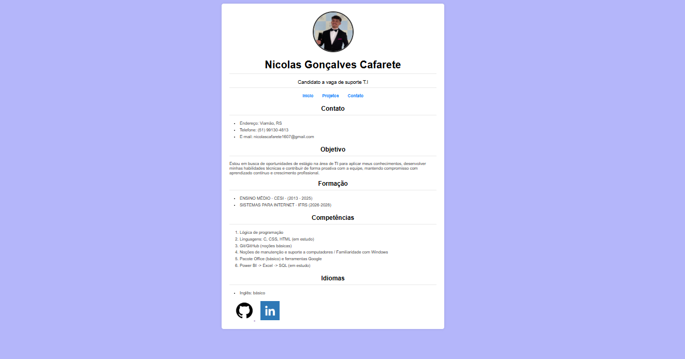

# 💼 Currículo Online – Nicolas Cafarete

Este repositório contém a versão online do meu **currículo**, desenvolvido com **HTML e CSS**. O projeto foi criado para apresentar minhas informações acadêmicas, profissionais e habilidades de forma clara, organizada e visualmente atrativa na web.

O objetivo é mostrar um exemplo de projeto prático em HTML/CSS, mostrando como criar layouts simples, responsivos e bem estruturados.

## 🖼️ Screenshot

Abaixo está uma captura de tela do meu currículo online:

## 🔨 Estrutura do Projeto

O projeto foi organizado em seções para facilitar a navegação e a atualização do conteúdo:

- **Cabeçalho:** Nome, foto e informações de contato  
- **Resumo Profissional:** Breve descrição das minhas competências e objetivos  
- **Formação Acadêmica:** Histórico escolar e cursos relevantes  
- **Experiência Profissional:** Empresas, cargos e principais responsabilidades  
- **Habilidades:** Competências técnicas e interpessoais  
- **Projetos:** Trabalhos ou projetos relevantes  
- **Contato:** E-mail, telefone e links profissionais  

O CSS garante que o layout seja **limpo, legível e responsivo**, adaptando-se a diferentes tamanhos de tela.

## 🚀 Objetivos do Projeto

- Criar uma versão online do meu currículo, de fácil acesso e compartilhamento  
- Centralizar minhas informações profissionais em um único local  
- Demonstrar habilidades práticas em **HTML e CSS**  
- Servir como referência ou modelo para futuros projetos de portfólio  

---

*Algumas informações podem estar desatualizadas, esse é o primeiro esboço, irei atualiza-lo em outro momento.
